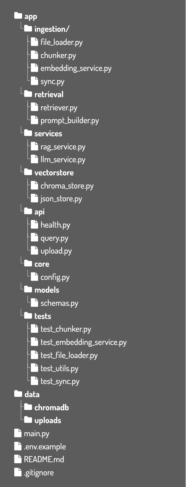
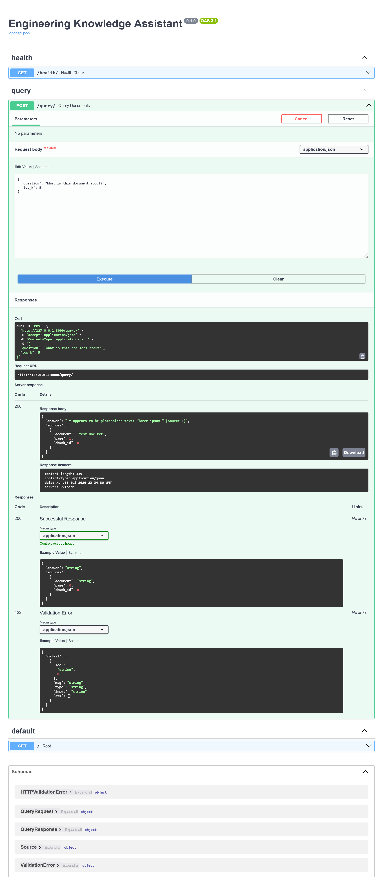

# Engineering Knowledge Assistant

An end-to-end Retrieval-Augmented Generation (RAG) system for searching and querying engineering documentation using semantic search and large language models.

This project was built from first principles to better understand the architecture of production AI systems. Rather than relying on high-level orchestration frameworks, each component of the RAG pipeline was implemented independently, including document ingestion, semantic chunking, embedding generation, vector storage, retrieval, prompt construction, and API integration.

The result is a modular backend that demonstrates software engineering principles alongside modern machine learning workflows.

---

## Features

- Automatic ingestion of engineering documents
- PDF document parsing
- Semantic document chunking with overlapping context
- SentenceTransformer embedding generation
- ChromaDB persistent vector database
- Semantic similarity search
- Retrieval-Augmented Generation (RAG)
- OpenAI language model integration
- Source citation generation
- FastAPI REST API
- Automatic synchronization of newly added documents
- Modular architecture with clear separation of responsibilities

---

## Motivation

Modern RAG frameworks such as LangChain and LlamaIndex make it possible to build document assistants quickly, but abstract away much of the underlying architecture.

The goal of this project was to understand how these systems actually work by implementing each stage manually. Building every component independently provided a much deeper understanding of:

- document preprocessing
- semantic chunking
- embedding generation
- vector databases
- similarity search
- prompt engineering
- API architecture
- modular software design

This project serves both as a learning exercise and as a foundation for more advanced AI assistants.

---

# System Architecture




---

# Document Ingestion Pipeline

Documents are processed through a streaming ingestion pipeline.


### Pipeline Stages

**File Loader**

Determines the document type and dispatches to the appropriate parser. The architecture is designed to support future document types beyond PDF and txt.

**PDF Loader**

Extracts text page-by-page while preserving document metadata required for source citations.

**Chunker**

Splits pages into overlapping semantic chunks to preserve context during retrieval while maintaining citation granularity.

**Embedding Service**

Generates dense vector embeddings using a SentenceTransformer model.

**Vector Store**

Stores embeddings and metadata inside a persistent ChromaDB collection.

---

# Retrieval Pipeline

When a user asks a question, the following workflow is executed.


---

# Project Structure


---

# Design Philosophy

A major design goal of this project was maintaining **clear separation of responsibilities**.

Each module performs one well-defined task.

| Module | Responsibility |
|---------|----------------|
| File Loader | Dispatch document parsers |
| PDF Loader | Extract document text |
| Text Loader | Extract document text |
| Chunker | Split text into semantic chunks |
| Embedding Service | Generate vector embeddings |
| Chroma Store | Persistent vector storage |
| Retriever | Semantic similarity search |
| Prompt Builder | Construct LLM prompts |
| LLM Service | Interface with OpenAI |
| RAG Service | Orchestrate the complete pipeline |
| FastAPI | Expose REST endpoints |

This architecture keeps components independently testable and easily replaceable.

---

# API



# Technologies

- Python
- FastAPI
- ChromaDB
- OpenAI API
- Sentence Transformers
- PyTorch
- NumPy
- pypdf
- Pydantic

---

# Future Improvements

- Conversational memory
- Metadata filtering
- Support for additional document formats
- Streaming LLM responses
- Local LLM support
- Authentication
- Docker deployment
- Automated evaluation framework
- Hybrid keyword/vector retrieval
- Web interface

---

# Lessons Learned

Building this project from scratch provided practical experience with the tradeoffs involved in production AI systems.

Some of the most valuable lessons included:

- Designing modular software with clear interfaces between components
- Balancing retrieval quality against chunk size and overlap
- Understanding how vector databases differ from traditional storage
- Managing document metadata for reliable source attribution
- Separating offline indexing from online retrieval for scalability
- Structuring AI systems so that components remain independently testable and extensible

---

# Installation

```bash
git clone https://github.com/<your-username>/EngineeringKnowledgeAssistant.git

cd EngineeringKnowledgeAssistant

pip install -r requirements.txt
```

Create a `.env` file containing:

```text
OPENAI_API_KEY=your_api_key_here
```

---

# Running

Start the application


```bash
uvicorn app.main:app --reload
```

The interactive API documentation is available at

```
http://localhost:8000/docs
```

---

## Why I Built This

I built this project as part of my goal of becoming a stronger Machine Learning Engineer. Rather than treating modern AI systems as black boxes, I wanted to understand the architecture that enables Retrieval-Augmented Generation systems by implementing each stage myself.

While there are many excellent frameworks available for building RAG applications, constructing the pipeline from first principles provided a much deeper understanding of semantic search, vector databases, software architecture, and the engineering tradeoffs involved in deploying production AI systems.
